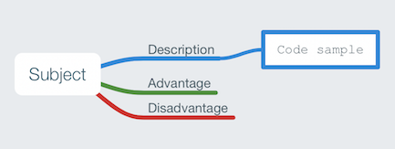
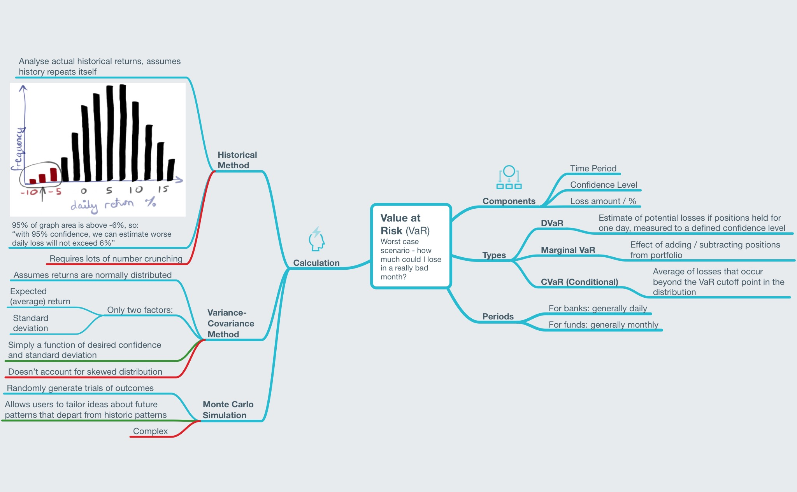

[Mindnode](https://mindnode.com) mind maps to aid learning financial technology concepts and calculations

A work in progress - pull requests gladly accepted.

See also:

* [mindmaps-scala-java](https://github.com/chrisbeach/mindmaps-scala-java)
* [mindmaps-data-structures](https://github.com/chrisbeach/mindmaps-data-structures)

### Key

# Markets

## Risk

### Key Technical Challenges

* Number-crunching to analyse historic data (see VaR below). Big data analysis: HDFS, Hive, Spark

## FX

### Products

### Key Technical Challenges

* 24/7 markets. **Zero-downtime**: release management, hot-deployment, monitoring
* E-trading, auto-hedging. **Low-latency**: performance management, garbage collection

## Settlements / Market Data

### Key Technical Challenges

* Audit. **Bi-temporal** data storage. Recording provenance of data and decisions

